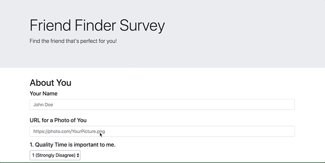

# FriendFinder - Express API Dating Service
## Summary
FriendFinder is a fullstack application that runs Express-based server-side code alongside a Bootstrap frontend. Users are able to post a simplified profile consisting of a name, image (via URL), and an array of answers to 10 compatibility questions. Via the API routes that are used in the application, users can post their profile to the server and recieve a return of their best match from other users of the application based on their compatibility score. Please continue reading to learn more!

### Module Dependencies
The following Node modules are used (and are included in the package.json file):
* Express - used for server-side code to handle routing and requests.
* Path - used for working with file and directory paths.

### Basic Functionality: Complete the Survey and Find a Match
* Going to the homepage will show us a link to take the survey.
* Upon going to the survey, the user will fill out their name, a URL for their profile picture, and answer 10 compatibility questions.
* Once they hit submit, the user's response will be POSTED via the API routes (see the file "apiRoutes.js" in the repo).
* Once the post is confirmed to have been successful, the compatibility logic will run (see details in the "Compatibility Logic" section below) and the best match from previous entries to the API will be displayed in a modal on-screen.
* The GIF below shows us a sample of the user experience.
  

### API Route Link
* Clicking this link will take the user to a list of users that have been posted to the API in an array of JSON objects, as seen below.
* As can be seen in the GIF below, the user that we just posted in the previous example shows up in our array.

### Simple Form Validation
* The application utilizes simple form validation logic to ensure the user has provided all the necessary information. If something is missing, a modal will appear instructing them further.
* This also serves the purpose of preventing invalid or incomplete data from being posted through the API routes.

### Compatibility Logic
* Firstly, note that the user answers the 10 compatibility questions on a scale of 1 to 5, with 1 being strongly disagree and 5 being strongly agree. As such, we effectively have 10 "scores" from each user answering the questions.
* Upon posting their response, the user's answers will then be compared to every other user of the application to find the first closest match.
* The closest match is determined by finding the total difference between the user's scores and a prospective match's scores. For example, if, on question 3, our user provided a score of 2, while the potential match provided a score of 5, the difference between their scores would be 3 for this question. The same logic is applied to all 10 questions and a total difference is calculated. 
* Whoever has the lowest total difference from the user will be considered their best match and is posted to the results modal.
* The detailed logic for this can be seen in the file "apiRoutes.js".
