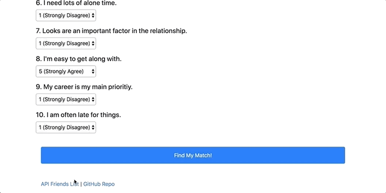

# FriendFinder - Express API Dating Service
## Summary
FriendFinder is a fullstack application that runs Express-based server-side code alongside a Bootstrap frontend. Users are able to post a simplified profile consisting of a name, image (via URL), and an array of answers to 10 compatibility questions. Via the API routes that are used in the application, users can post their profile to the server and recieve a return of their best match from other users of the application based on their compatibility score. Please continue reading to learn more!

### Module Dependencies
The following Node modules are used (and are included in the package.json file):
* Express - used for server-side code to handle routing and requests.
* Path - used for working with file and directory paths.

### Basic Functionality: Complete the Survey and Find a Match
* Going to the homepage will show us a link to take the survey.
* Upon going to the survey, the user will fill out their name, a URL for their profile picture, and answer 10 compatibility questions.
* Once they hit submit, the user's response will be POSTED via the API routes (see apiRoutes.js).
* Once the post is confirmed to have been successful, the compatibility logic will run (see details in the "Compatibility Logic" section below) and the best match from previous entries to the API will be displayed in a modal on-screen.
  

### API Route Link
* Clicking this link will take the user to a list of users that have been posted to the API in an array of JSON objects, as seen below.

### Compatibility Logic
* 

### Bamazon Manager Function 3: *Add to Inventory*
* This feature will allow the manager to increase the inventory of an item already in stock.
* It will then report the new stock and ensure the database is updated.

### Bamazon Manager Function 4: *Add New Product*
* This feature will allow the manager to add a brand new product (database line item) to the inventory
* It will ask the manager questions about all the details needed to add the item.

* As can be seen below, the item, "PBJ", that was just entered, is now shown when querying the database for available products.

### Bamazon Manager Function 5: *I'm done here*

* Lastly, when you are done with your managerial tasks, you can exit the application.

